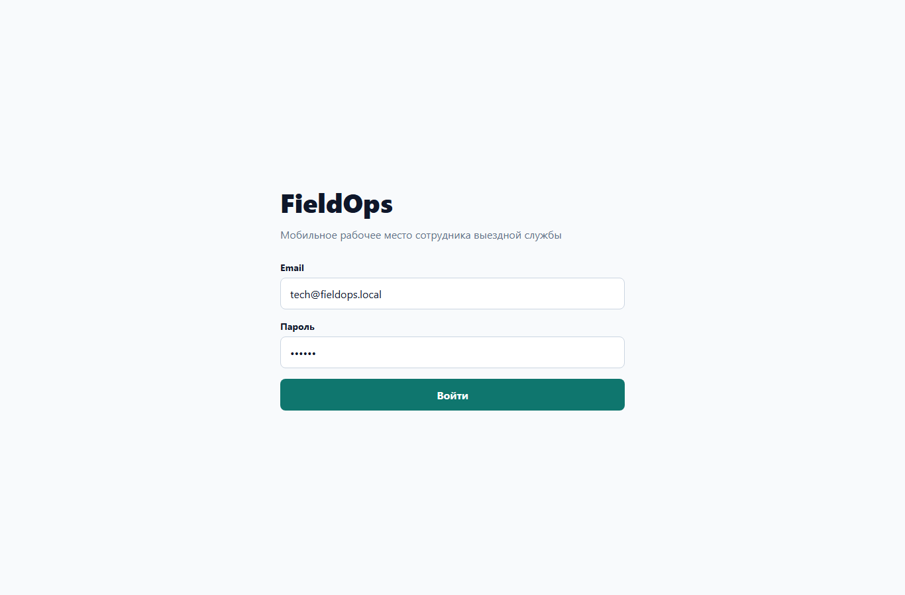
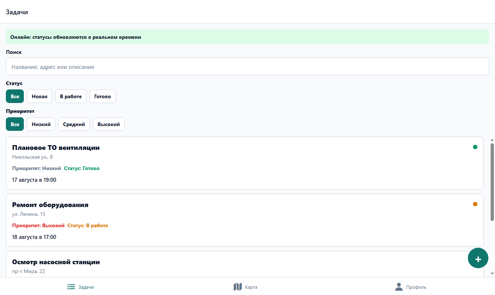

# FieldOps

[](https://github.com/toshnotik/FieldOps/actions/workflows/ci.yml)

FieldOps is a mobile-first React Native application for field service employees. It demonstrates a production-style Expo architecture with authentication, task management, map support, local app state, form validation, mock REST API calls, and tests.

## Screenshots

| Login | Realtime task list |
| --- | --- |
|  |  |

## Stack

- React Native + Expo
- TypeScript
- Expo Router
- TanStack Query
- Zustand
- React Hook Form + Zod
- Mock REST API layer
- Mock realtime task events
- Offline queue with AsyncStorage
- react-native-maps
- Expo Location
- Expo ImagePicker / Camera
- Expo Notifications
- GitHub Actions CI
- SecureStore
- Jest + React Native Testing Library

## Features

- Login with email/password validation
- Access token persistence and automatic sign-in
- Task list with search, filters, pull-to-refresh, loading/error/empty states, and pagination
- Task details with status changes, comments, photos, assignee, deadline, address, and coordinates
- Realtime task status updates through `RealtimeProvider` and `taskRealtime`
- Offline status/comment queue with automatic sync after the device returns online
- Push/local notifications for remote task status changes on native platforms
- Native map with task markers and a web fallback view
- Create task flow
- Profile screen with task statistics, theme toggle, and logout

## Realtime, Offline, Notifications

The backend is intentionally mocked, but the app demonstrates the production flow boundaries:

- `src/shared/api/realtime.ts` exposes a WebSocket-like task event channel.
- `src/providers/RealtimeProvider.tsx` connects after auth while the device is online, updates TanStack Query cache, and starts mock remote status simulation.
- `src/features/offline/offlineQueue.ts` stores offline status/comment operations in AsyncStorage.
- `src/providers/NetworkProvider.tsx` watches NetInfo and replays queued operations when auth and connectivity are available.
- `src/providers/NotificationsProvider.tsx` requests native notification permissions and schedules a local notification for remote status changes.

To demo the flow:

1. Sign in with the demo credentials below.
2. Open the task list and wait for the green realtime banner.
3. Disconnect the network in the simulator/device and change a task status or add a comment.
4. Reconnect the network; queued changes are replayed and the task list refreshes.
5. On native platforms, remote mock status changes trigger local notifications after permission is granted.

## Getting Started

Install dependencies:

```bash
npm install
```

Run the app:

```bash
npm start
```

Run web:

```bash
npm run web
```

Run tests:

```bash
npm test -- --runInBand
```

Run lint:

```bash
npm run lint
```

Run TypeScript checks:

```bash
npm run typecheck
```

## Demo Login

```text
Email: tech@fieldops.local
Password: 123456
```

## Project Structure

```text
app/                 Expo Router routes
src/entities/        Domain models and entity UI
src/features/        Feature-level logic
src/providers/       App providers
src/screens/         Screen implementations
src/shared/          API, UI primitives, hooks, utils, shared types
src/store/           Zustand stores
```

## Notes

The backend is mocked in `src/shared/api/client.ts`, so the app can be run without external services. The map screen uses `react-native-maps` on native platforms and a web-specific fallback because native map rendering is not supported by Expo Web in the same way.

GitHub Actions runs lint, TypeScript checks, and Jest tests on every pull request and push to `main`.
